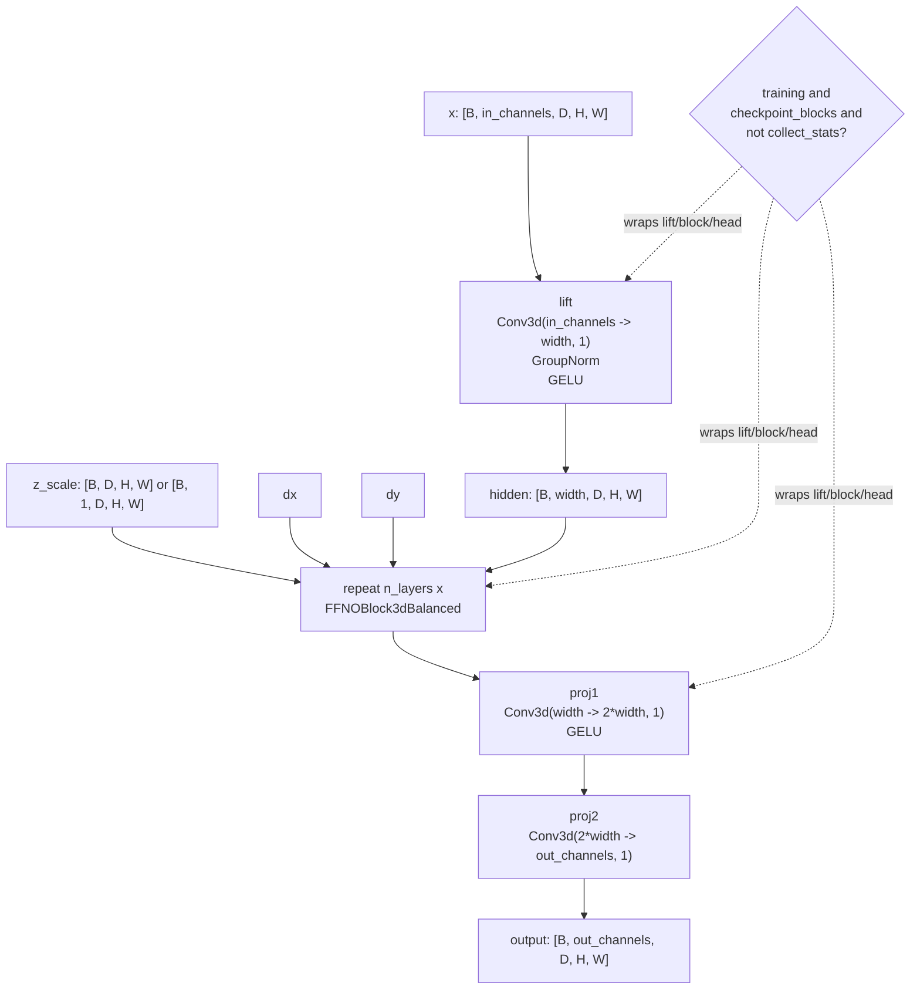
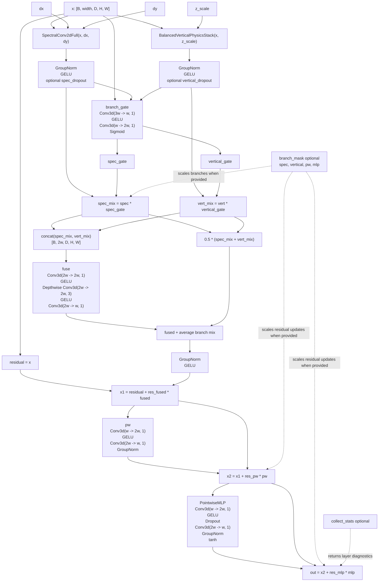
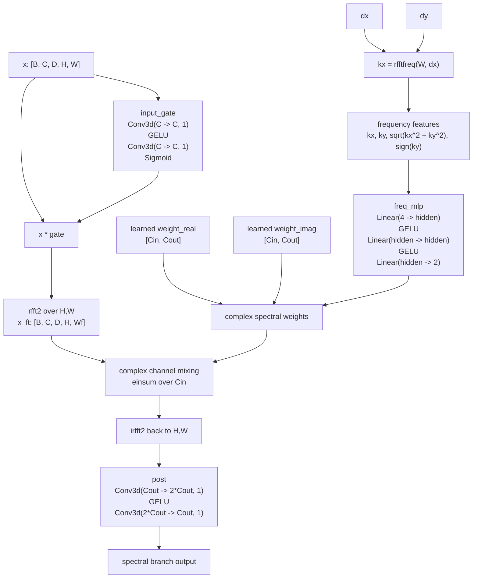
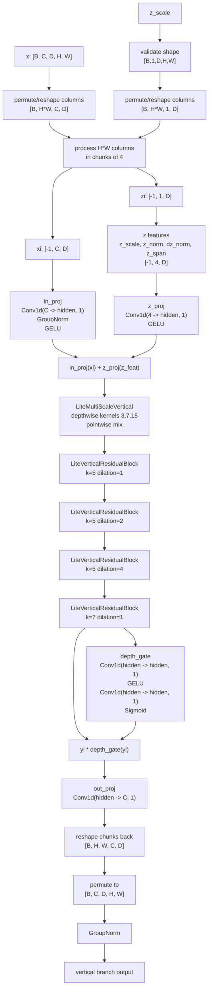

# FFNO3D Model Flowchart

Source: [`models/ffno_model.py`](../models/ffno_model.py)

## Full Forward Pass

## `FFNOBlock3dBalanced`

## `SpectralConv2dFull`

## `BalancedVerticalPhysicsStack`

## Residual Scalars

The block learns three scalar residual strengths:

| Parameter | Initial value | Applied to |
| --- | ---: | --- |
| `res_fused` | `1.0` | gated spectral/vertical fusion |
| `res_pw` | `0.15` | pointwise convolution correction |
| `res_mlp` | `0.15` | pointwise MLP correction |

